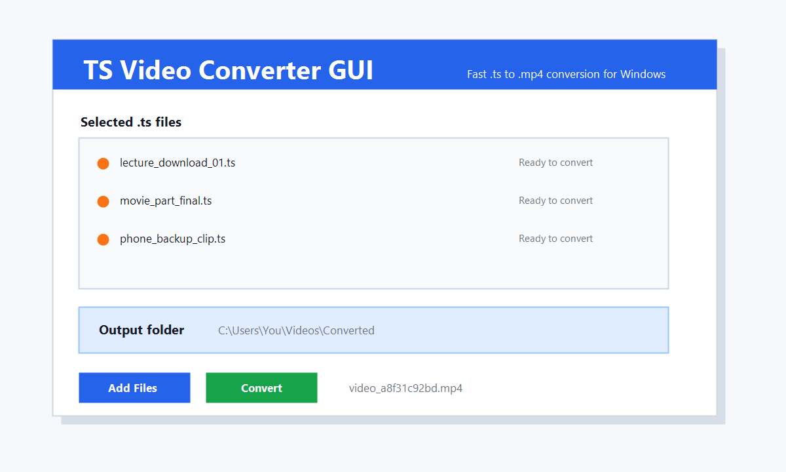

<div align="center">

# TS Video Converter GUI

### Turn laggy `.ts` video downloads into clean `.mp4` files in seconds.

[](#)
[](https://ffmpeg.org/)
[](https://github.com/Samnannn/ts-video-converter-gui/releases/latest)
[](#license-note)



**No terminal. No paid converter. No separate Python or ffmpeg setup for normal users.**

[Download Latest Version](https://github.com/Samnannn/ts-video-converter-gui/releases/latest)

</div>

## The Problem

Some video downloaders save videos as `.ts` files instead of normal `.mp4` files. Those files can lag in VLC, behave badly in other popular media players, and feel even worse after moving them to a phone.

Converting them with VLC or heavy paid converter tools can be slow, confusing, and unnecessary when you only need a clean playable MP4.

## The Fix

TS Video Converter GUI is a lightweight Windows app that converts `.ts` videos into `.mp4` files using fast ffmpeg stream copy.

That means it usually does not re-encode the whole video. It simply remuxes the existing video and audio into an MP4 container, so conversion can finish very quickly while keeping the original quality.

## Features

| Feature | What It Means |
| --- | --- |
| Multiple file selection | Select many `.ts` videos at once |
| Output folder picker | Save converted files wherever you want |
| Random unique names | Prevents accidental overwriting |
| Fast stream copy | Uses `ffmpeg -c copy` for quick conversion |
| Lightweight GUI | Simple Windows app, no confusing menus |
| Bundled release build | Users do not install Python or ffmpeg manually |

## Download

Download the latest Windows zip from the Releases page:

[**Download TSVideoConverterGUI-Windows.zip**](https://github.com/Samnannn/ts-video-converter-gui/releases/latest)

After downloading:

1. Extract the zip file
2. Run `TSVideoConverterGUI.exe`
3. Select your `.ts` files
4. Choose an output folder
5. Click `Convert`

Your converted videos will be saved with names like:

```text
video_a8f31c92bd.mp4
```

## How It Works

Behind the scenes, the app runs ffmpeg like this:

```text
ffmpeg -i input.ts -c copy -map 0 output.mp4
```

This copies the existing streams into an MP4 file without re-encoding whenever possible.

## For Developers

Run from source:

```powershell
python app.py
```

When running from source, you need Python and ffmpeg installed on your machine.

## Build The Windows App

Put `ffmpeg.exe` here:

```text
vendor/ffmpeg.exe
```

Install build tools:

```powershell
python -m pip install -r requirements-dev.txt
```

Build:

```powershell
powershell -ExecutionPolicy Bypass -File scripts/build-windows.ps1
```

The final app will be created here:

```text
dist/TSVideoConverterGUI.exe
```

## License Note

This project can bundle ffmpeg for convenience. ffmpeg has its own license terms, so include ffmpeg license information when publishing release builds.
