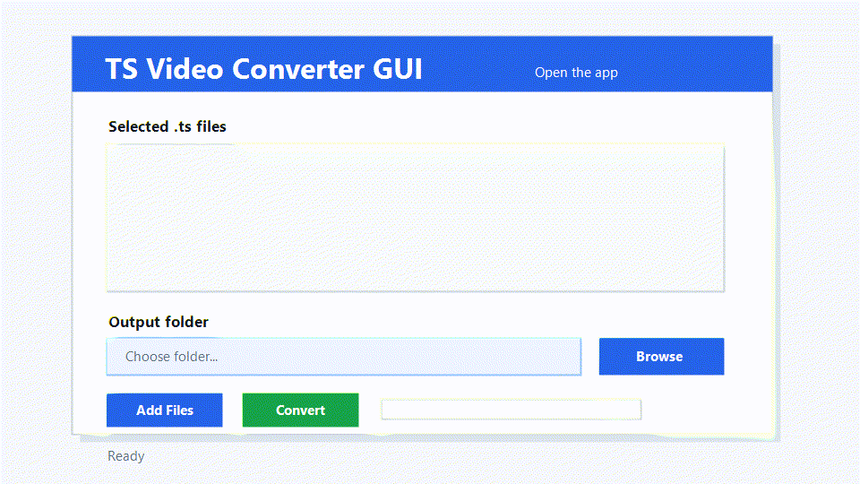

<div align="center">

# TS Video Converter GUI

### Convert laggy `.ts` downloads into clean playable `.mp4` videos — fast, lightweight, and no terminal required.

[](#)
[](https://ffmpeg.org/)
[](https://github.com/Samnannn/ts-video-converter-gui/releases/latest)
[](#license-note)



**No terminal. No paid converter. No separate Python or ffmpeg setup for normal users.**

[Download Latest Version](https://github.com/Samnannn/ts-video-converter-gui/releases/latest)

</div>

## The Problem

Some video downloaders save videos as `.ts` files instead of normal `.mp4` files. Those files can lag in VLC, behave badly in other popular media players, and feel even worse after moving them to a phone.

Converting them with VLC or heavy paid converter tools can be slow, confusing, and unnecessary when you only need a clean playable MP4.

## The Fix

TS Video Converter GUI is a lightweight Windows app that converts `.ts` videos into `.mp4` files using fast ffmpeg stream copy.

That means it usually does not re-encode the whole video. It simply remuxes the existing video and audio into an MP4 container, so conversion can finish very quickly while keeping the original quality.

## Why Not VLC?

VLC can convert TS files, but:

- settings can be confusing
- conversion is often slower
- accidental re-encoding can reduce quality
- batch workflows are inconvenient

TS Video Converter GUI focuses on one thing:

**fast TS to MP4 conversion with minimal setup.**

## Features

| Feature | What It Means |
| --- | --- |
| Multiple file selection | Select many `.ts` videos at once |
| Output folder picker | Save converted files wherever you want |
| Random unique names | Prevents accidental overwriting |
| Fast stream copy | Uses `ffmpeg -c copy` for quick conversion |
| Lightweight GUI | Simple Windows app, no confusing menus |
| Bundled release build | Users do not install Python or ffmpeg manually |

## Common Use Cases

- IPTV recordings
- Telegram video downloads
- Stream recordings
- Camera TS footage
- VLC playback issues
- Mobile playback compatibility

## Example Performance

Example result on a normal Windows laptop:

| File | Conversion Time | Quality Loss | CPU Usage |
| --- | ---: | --- | --- |
| 2.1 GB TS file | ~18 seconds | none | minimal |

Actual speed depends on your drive, file size, and the streams inside the TS file.

## Download

Download the latest Windows zip from the Releases page:

[**Download TSVideoConverterGUI-Windows.zip**](https://github.com/Samnannn/ts-video-converter-gui/releases/latest)

After downloading:

1. Extract the zip file
2. Run `TSVideoConverterGUI.exe`
3. Select your `.ts` files
4. Choose an output folder
5. Click `Convert`

Your converted videos will be saved with names like:

```text
video_a8f31c92bd.mp4
```

## How It Works

Behind the scenes, the app runs ffmpeg like this:

```text
ffmpeg -i input.ts -c copy -map 0 output.mp4
```

This copies the existing streams into an MP4 file without re-encoding whenever possible.

## Built With

- Python
- Tkinter
- FFmpeg
- PyInstaller

## Notes

Some TS files may contain codecs or streams that are not fully compatible with MP4 containers. In those cases, re-encoding may be required.

This app is designed for fast remuxing first. If your file needs full codec conversion, use an ffmpeg re-encode command or a converter that supports re-encoding.

## For Developers

Run from source:

```powershell
python app.py
```

When running from source, you need Python and ffmpeg installed on your machine.

## Build The Windows App

Put `ffmpeg.exe` here:

```text
vendor/ffmpeg.exe
```

Install build tools:

```powershell
python -m pip install -r requirements-dev.txt
```

Build:

```powershell
powershell -ExecutionPolicy Bypass -File scripts/build-windows.ps1
```

The final app will be created here:

```text
dist/TSVideoConverterGUI.exe
```

## License Note

This project can bundle ffmpeg for convenience. ffmpeg has its own license terms, so include ffmpeg license information when publishing release builds.

## Keywords

ts to mp4 converter, ffmpeg gui, ts video converter, windows video converter, stream copy converter, lightweight ffmpeg frontend, vlc ts to mp4, laggy ts files, ts playback fix, desktop video converter
